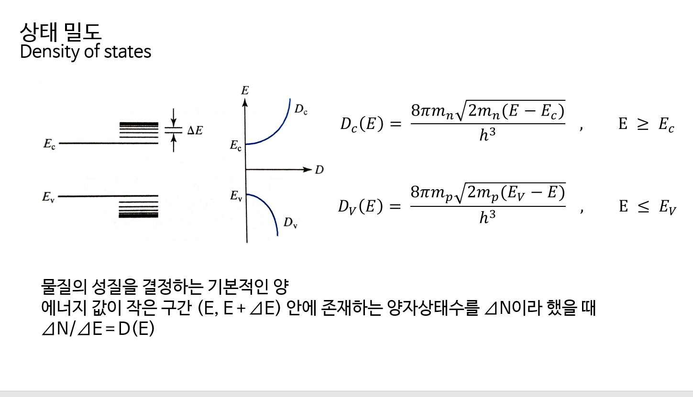

## 상태 밀도

상태 밀도란 에너지 준위의 분포 밀도를 말하며 물질의 성질을 결정하는 기본적인 양이다.

에너지 값이 작은 구간$$(E, E+\Delta E$$) 안에 존재하는 양자 상태수를 $$\Delta N$$이라 했을 때 양자 상태수를 에너지 값으로 나눈 $$\Delta N/\Delta E$$으로 상태 밀도 D(E)를 구할 수 있다. 따라서 전도띠에서 상태 밀도는 다음과 같이 나타낼 수 있다.

> $$D_{C}(E) \equiv \frac{\text{number of sates in} \Delta E} {\Delta E \times volume}$$
                  

위 식을 이용하여 전도띠와 원자가띠에서의 상태 밀도를 유도해낼 수 있다.

## 페르미 함수 (페르미-디랙 통계)

페르미 함수란 에너지 준위가 전자로 채워질 확률에 대한 함수를 말한다. 
페르미 함수는 통계적 분포 계산을 통해 구할 수 있다. 통계역학에서, 에너지$$\varepsilon$$ 을 가지는 입자의 수는$$n(\varepsilon) = g(\varepsilon)f(\varepsilon)$$ 이다. 이 때 $$g(\varepsilon)$$는 에너지 $$\varepsilon$$를 가지는 상태들의 수이고, $$f(\varepsilon)$$는 분포함수로, 에너지 $$\varepsilon$$을 가지는 상태에 존재하는 입자들의 평균 개수이다. 양자 통계를 이용하면, 페르미온이 에너지 $$\varepsilon$$인 상태를 점유할 확률 $$f(\varepsilon)$$는 다음과 같이 나타난다.
> $$f_{FD}(\varepsilon) = \frac{1}{e^\alpha e^{\varepsilon/kT} -1}$$

위 함수는 페르미-디락 분포함수이다. 페르미 준위($$E_{f}$$)는 전자가 50%으로의 확률로 채워지는 준위를 말하는데, 이는 함수를 이용하면 $$f_{FD}(\varepsilon) = \frac{1}{2}$$이고 이때의 에너지인 페르미 에너지는 $$\varepsilon_{F} = -\alpha kT$$이다. 따라서 를 이용하여 페르미-디락 분포함수를 다시 표현하면 페르미 함수
> $$f(E) = \frac{1}{1+e^{(E-E_{F})/kT}}$$

를 구할 수 있다.

에너지 밴드 다이어그램, 상태 밀도, 확률 함수, 캐리어 분포의 그래프를 비교하면 다음과 같다. 

## n과 p에 대하여
상태 밀도 함수와 페르미 함수를 이용하여 전자 밀도 n과 정공 밀도 p에 대한 식을 유도할 수 있다.

이러한 과정을 통해 n과 p는 다음과 같음을 알 수 있다. 
> $$ n = N_{C}e^{-(E-E_{F})/kT},  p = N_{V}e^{-(E_{F}-E_{V})/kT)} $$
                   
이때 $$N_{C}$$는 유효 상태 밀도 (effective density of states), $$N_{V}$$는 원자가띠의 유효 상태 밀도 (effective density of states of the valence band)이고, 각각 $$N_{C} \equiv 2[\frac{2\pi m_{n}kT}{h^{2}}]^{3/2}$$,$$N_{V} \equiv 2[\frac{2\pi m_{p}kT}{h^{2}}]^{3/2}$$의 값을 가진다. 

300K에서 Ge, Si, GaAs의 $$N_{C}$$와 $$N_{V}$$값은 다음과 같다.

다음으로 n과 p를 곱하여 np product를 구한다.  

결과로 얻은 $$n = p = n_{i}$$의 성질을 갖는 반도체를 진성 반도체(intrinsic semiconductor)라 하고 이는 불순물이 섞이지 않은 순수한 반도체를 말한다. 이때 $$n_{i}$$는 $$n_{i} = \sqrt{N_{C}N_{V}}e^{-E_{g}/2kT}$$의 값을 가지며 진성 캐리어 밀도이다. 

 

반도체에는 전자, 정공, 양전하를 띤 도너이온, 음전하를 띤 억셉터이온으로 4가지의 전하를 가진다고 할 수 있다. 그것들의 밀도는 각각 $$n, p, N_{d}, N_{a}$$로 나타낸다. 전하 중성(Charge neutrality)으로 인해 음전하밀도와 양전하밀도는 같고, 이는 다음과 같이 나타낼 수 있다.  
> $$n + N_{a} = p +N_{d}$$

$$np = n_{i}^{2}$$ 와 위 식을 이용하여 n과 p에 대한 식을 구하면 다음과 같다.
> $$n = \frac{N_{d}-N_{a}}{2} + [(\frac{N_{d}-N_{a}}{2})^{2} + n_{i}^{2}]^{1/2}, p = \frac{N_{a}-N_{d}}{2} + [(\frac{N_{a}-N_{d}}{2})^{2} + n_{i}^{2}]^{1/2}$$
   

여기서 두 가지 경우를 생각해볼 수 있다.
첫 번째로  $$N_{d} - N_{a} \gg n_{i}$$(N 타입 반도체)의 경우,
$$n = N_{d} - N_{a}, p = n_{i}^{2}/n$$  이고, $$N_{d} \gg N_{a}$$ 이면 $$n = N_{d}, p = n_{i}^{2}/N_{d}$$이다.
두 번째로 $$N_{a} - N_{d} \gg n_{i}$$ (P 타입 반도체)의 경우,
$$p = N_{a} - N_{d}, n = n_{i}^{2}/p$$  이고, $$N_{a} \gg N_{d}$$ 이면 $$n = n_{i}^{2}/N_{a}, p = N_{a}$$이다.

## 캐리어 농도
다음은 300K와 400K에서 Si의 도펀트 밀도($$N_{a}, N_{d}$$) vs, 페르미 준위($$E_{F}$$)를 나타낸 것이다.

도핑이 매우 많이 된($$>10^{19}cm^{-3}$$) 반도체에서는 $$n = N_{C}e^{-(E-E_{F})/kT}$$과 $$p = N_{V}e^{-(E_{F}-E_{V})/kT}$$을 유도하기 위해 볼츠만 근사(Boltzmann approximation)의 사용이 유효하지 않다. 

캐리어 농도는 매우 높거나 낮은 온도에서 다르게 표현된다.  

매우 높은 온도에서는 진성 캐리어 밀도 $$n_{i}$$가 커서 $$n_{i} \gg \lvert N_{d} - n_{a} \rvert$$로 나타낼 수 있다. 이에 전자밀도 n과 정공밀도 p($$n = \frac{N_{d}-N_{a}}{2} + [(\frac{N_{d}-N{a}}{2})^{2} + n_{i}^{2}]^{1/2}$$, $$p =  \frac{N_{a}-N_{d}}{2} + [(\frac{N_{a}-N{d}}{2})^{2} + n_{i}^{2}]^{1/2}$$) 는 $$n_{i}$$와 같다고 말할 수 있다 ( $$n = p = n_{i}$$ ). 따라서 매우 높은 온도에서 반도체는 진성반도체가 된다고 할 수 있다. 반면 매우 낮은 온도에서는 $$E_{F}$$가 $$E_{d}$$보다 높아져 대부분의 도너/억셉터는 이온화되지 않은 채로 남게 된다. 이러한 현상을 freeze-out이라고 한다. 이러한 영역에서 전자밀도 n은 다음과 같이 나타난다.  
> $$ n = [\frac{N_{C}N_{d}}{2}]^{1/2}e^{-(E_{C}-E_{d})/2kT}$$
